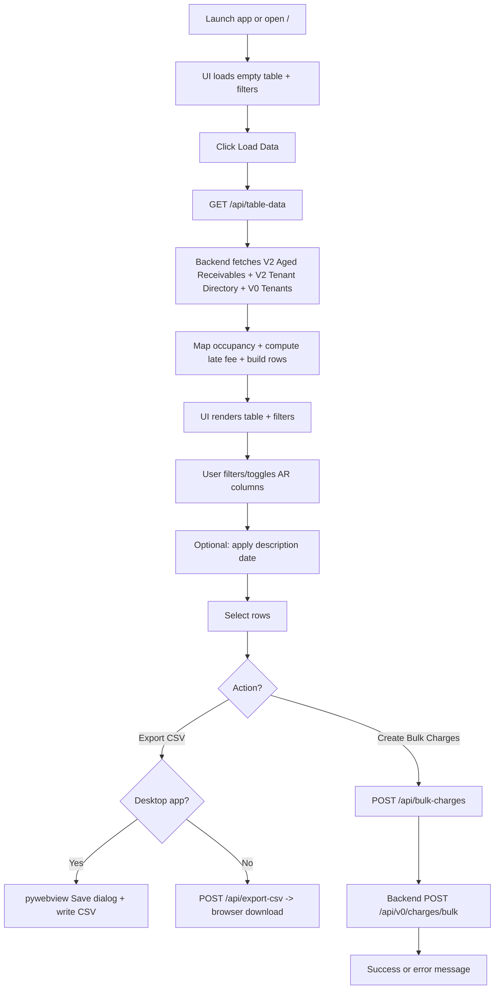
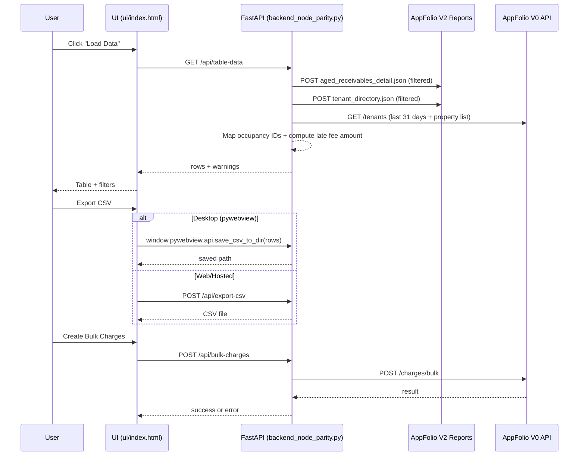

# Bulk Charge App Flow

This document describes the end-to-end user journey and data flow for the Bulk Charges Builder desktop/web app.

**Scope**
- Desktop runner: `main.py` (pywebview + local FastAPI)
- UI: `ui/index.html`
- API: `backend_node_parity.py`

**Actors**
- User
- UI (browser or pywebview)
- Local API (FastAPI)
- AppFolio V2 Reports
- AppFolio V0 API

**User Journey (Step-by-Step)**
1. User launches the desktop app (`main.py`) or opens the hosted UI at `/`.
2. The UI loads with an empty table and filter controls.
3. The user clicks **Load Data**.
4. The UI requests `GET /api/table-data`.
5. The backend fetches and merges V2 Aged Receivables report rows, V2 Tenant Directory rows, and V0 Tenants (31-day window + property list).
6. The backend maps occupancy IDs, computes late fee amounts, and returns rows + warnings.
7. The UI renders the table, populates filters, and sets the default description date.
8. The user filters by property, charge date (month/year), and optional 0-30 minimum.
9. The user can toggle AR columns (0-30 and Monthly Rent).
10. The user can apply a description date to the currently filtered rows.
11. The user selects rows.
12. The user exports CSV or creates bulk charges.

**Mermaid - User Journey Flow**

**Mermaid - System Sequence**

**Backend Data Rules (Used by `/api/table-data`)**
- V2 Aged Receivables are filtered by `FILTER_GL_ACCOUNT` when set.
- Late fee amount is computed from `0_to30` and `total_amount` with property-specific thresholds.
- `Charge Date` and `Posting Date` default to today if missing.
- `Description` defaults to `IL Custom Late Fee - MM/01/YYYY` based on charge date.
- Rows missing `_v0OccupancyId` trigger a fallback V0 tenant fetch over a 10-year window.
- Warnings are returned if any upstream fetch fails or returns no rows.

**Primary API Endpoints**
- `GET /api/health`
- `GET /api/table-data`
- `POST /api/export-csv`
- `POST /api/bulk-charges`

